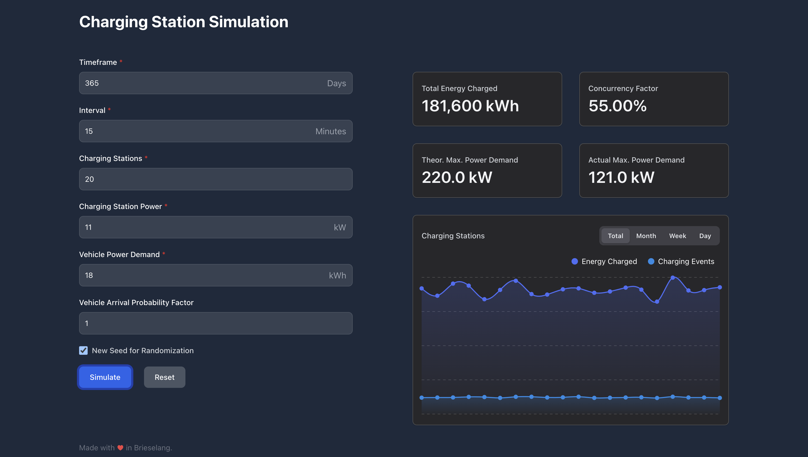

# Reonic Frontend Challenge

## Setup

### Install dependencies

```bash
$ yarn install
```

### Start development server

```bash
$ yarn dev
```

### Production build

```bash
$ yarn build
```

### Task 1

The input parameters provided in task 1 are the actual default values of the form I render in the frontend.
This means in order to check the results you just need to hit the simulate button.

The simulation core consists of three classes: [`ChargingStation`](https://github.com/chillyistkult/reonic_takehome/blob/master/src/lib/ChargingStation.ts), [`ChargingSimulation`](https://github.com/chillyistkult/reonic_takehome/blob/master/src/lib/ChargingSimulation.ts) and [`Vehicle`](https://github.com/chillyistkult/reonic_takehome/blob/master/src/lib/Vehicle.ts). The actual simulation happens in `ChargingSimulation.run()`.

In some of my test runs I reach concurrency factors of up to 60%. While I can of course not be 100% sure if there is no bug
in the simulation code or I just misunderstood parts of the task the numbers seems plausible to me. For example within 35040 ticks only two power spikes of  
132 kW across all charging points were registered. This seems at least not unlikely, because of the huge amount of random events happening.

Anyway I would be more then happy to discuss this further with you :).

> Run the program from task 1 for between 1 and 30 chargepoints. How does the
concurrency factor behave?

The more charging stations are added the lower the concurrency factor gets, but the correlation is not linear.

> If you consider the impact of DST vs. mapping the hours to the 1
5 minute ticks.

I do consider daylight saving time.

> If you seed the probabilities vs. using random() for random-but-deterministic
results.

The seed is actually encoded in the url with an option in the form to generate a new seed on every simulation run.

### Task 2

For the frontend I used Typescript, React, Tailwind and Mantine powered by Vite and Biome (Biome is a replacement for Eslint and Prettier).
The design is simple but elegant: There is a form that maps to all the input parameters you ask for in the task and another section to visualize the results.

The form is connected to the simulation core and the results are of course the actual results from the simulation.  

For the visualization of the results I used simple stat cards and a chart. There is room for improvement, e.g. by showing more interesting metrics, but I think 
the design conveys my idea of the frontend and since I already spent time on making not just a mockup, but an actual functioning frontend, I decided to not delve any deeper into the world of charts and numbers :).



#### Thank you for taking the time to review my solution, I hope you like it, but more so I hope you can provide me some guidance on areas I can improve.


